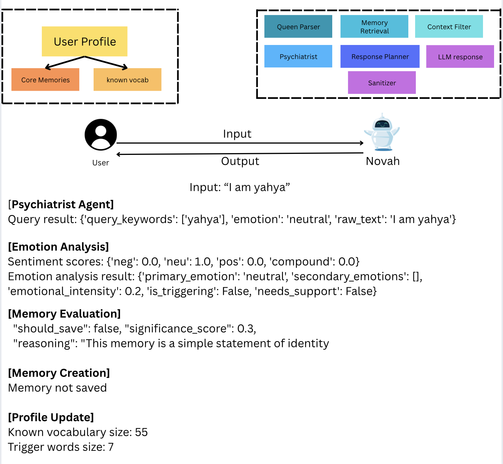

# NovahSpeaks
# Visit [NovahSpeaks](https://13.58.115.238/) for a live demo.


NovahSpeaks is an AI-powered chat application designed to provide a supportive and engaging conversation experience. The application features a modern, user-friendly interface with both text and voice interaction capabilities.

## 📁 Project Structure

```
NovahSpeaks/
├── agents/           # Agent implementations
├── data/            # Core memories and profiles
├── engine/          # Core engine components
├── utils/           # Utility functions
├── main.py          # Application entry point
├── llm_config.py    # LLM configuration
└── README.md        # This file
```

## 🌟 Features

### Core Features
- **Interactive Chat Interface**: Clean, modern UI with real-time message updates
- **Voice Input**: Record and transcribe your messages using the microphone
- **Text-to-Speech**: AI responses are converted to natural-sounding speech
- **User Profiles**: Personalized experience with name and emoji selection
- **Memory System**: Remembers past conversations and important details
- **Emotional Intelligence**: Analyzes and responds to emotional context
- **Vocabulary Building**: Tracks and learns from user's language patterns
- **Personalized Communication**: Tailored responses based on individual's core memories and experiences
- **Context-Aware**: Maintains conversation context and emotional awareness
- **Simplified Language**: Uses appropriate vocabulary and clear explanations
- **Emotional Support**: Maintains a consistent, supportive tone throughout interactions
- **Memory Integration**: Incorporates relevant past experiences into responses

### Voice Features
- **Speech-to-Text**: Convert your voice to text with a simple click
- **Recording Overlay**: Visual feedback during voice recording with animated waves
- **Stop Recording Button**: Easy-to-use stop button in the recording overlay
- **Audio Playback**: Clear audio playback of AI responses

### UI/UX Improvements
- **Modern Design**: Clean, intuitive interface with smooth animations
- **Responsive Layout**: Works seamlessly on both desktop and mobile devices
- **Visual Feedback**: Animated recording waves and status indicators
- **Easy Navigation**: Quick access to home page via the NovahSpeaks title
- **Accessible Input**: Large, clear text input with voice recording option
- **Dull Text Box**: Reduced eye strain with optimized input field colors

### Technical Features
- **Real-time Processing**: Immediate response to user input
- **Error Handling**: Robust error management and recovery
- **Profile Management**: Automatic saving of user preferences and progress
- **Memory Management**: Efficient storage and retrieval of conversation history
- **Emotional Analysis**: Advanced sentiment and emotion detection
- **Context Awareness**: Maintains conversation context for relevant responses

## 🏗️ Architecture


The system is built on a multi-agent architecture that works together to provide personalized responses:

### Core Components

1. **QueryParserAgent**
   - Analyzes user questions
   - Extracts intent, emotions, and key topics
   - Identifies the communication context

2. **MemoryRetrievalAgent**
   - Manages core memories database
   - Uses vector similarity search for relevant memories
   - Integrates with FAISS/Pinecone for efficient retrieval

3. **ContextFilterAgent**
   - Filters memories based on:
     - Emotional alignment
     - Vocabulary fit
     - Recency and relevance
   - Ensures appropriate cognitive load

4. **ResponsePlannerAgent**
   - Crafts structured prompts
   - Integrates selected memories with current context
   - Maintains consistent communication style

5. **LLMResponderAgent**
   - Generates responses using LLM
   - Maintains tone and style consistency
   - Ensures appropriate length and complexity

6. **SanitizerAgent**
   - Validates response safety
   - Ensures vocabulary compliance
   - Maintains consistent tone

## 🚀 Getting Started

### Prerequisites
- Python 3.8+
- Groq API key
- Required Python packages (see requirements.txt)

### Installation

1. Clone the repository:
```bash
git clone https://github.com/asaripa3/Novah.git
cd NovahSpeaks
```

2. Install dependencies:
```bash
pip install -r requirements.txt
```

3. Set up environment variables:
```bash
cp .env.example .env
# Add your GROQ_API_KEY to .env
```

4. Prepare your data:
- Add core memories to `data/core_memories.jsonl`
- Configure user profile in `data/yahya_profile.jsonl`

### Usage

1. **Initial Setup**:
   - Enter your name
   - Choose an emoji to represent you
   - Click "Start Chatting"

2. **Chatting**:
   - Type your message in the text box
   - Or click the microphone icon to record your voice
   - Click the stop button in the recording overlay to end recording
   - Click "Send" to send your message

3. **Voice Recording**:
   - Click the microphone icon to start recording
   - A recording overlay will appear with animated waves
   - Click the "Stop Recording" button to end recording
   - Your transcribed message will appear in the text box

4. **Navigation**:
   - Click the "NovahSpeaks" title to return to the home page
   - Use the back button to return to previous pages
